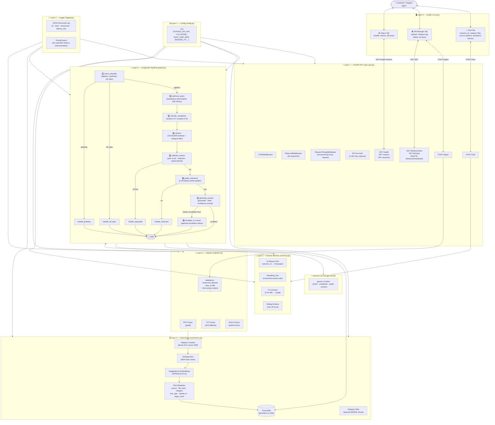

# 📦 Week 6 · Day 1 — Customer Support AI RAG Chat Agent (Logistics)

> **Domain**: SwiftShip Logistics Customer Support  
> **Stack**: FastAPI · ChromaDB · Google Gemini · LangGraph · Gradio  
> **Theme**: Production-ready demo with fundamentally solid, scalable architecture

---

## 🏗️ Project Structure

```
Week 6/Day 1 - Customer Support RAG Agent/
│
├── config.py           ← Centralized env + constants (Layer 1)
├── logger.py           ← Structured JSON logging (Layer 2)
├── ingestor.py         ← Document parsing: PDF / TXT / DOCX (Layer 3)
├── vectorstore.py      ← ChromaDB with metadata & category filters (Layer 4)
├── memory.py           ← Session-keyed conversational memory (Layer 5)
├── graph.py            ← LangGraph 10-node pipeline (Layer 6)
├── api.py              ← FastAPI layer + middleware + 8 endpoints (Layer 7)
├── ui.py               ← Gradio 3-tab branded interface (Layer 8)
│
└── sample_docs/
    ├── shipping_policy.txt     ← Demo: Zones, SLAs, rates, prohibited items
    └── tracking_guide.txt      ← Demo: Status codes, delay handling, claims
```

---

## ▶️ How to Run

```powershell
# From the root of text_summarizer/
.\\venv\\Scripts\\activate

# Terminal 1 — Start the Backend API
python "Week 6\\Day 1 - Customer Support RAG Agent\\api.py"

# Terminal 2 — Start the Gradio UI
python "Week 6\\Day 1 - Customer Support RAG Agent\\ui.py"
```

| Service | URL |
|---|---|
| Gradio UI | http://localhost:7860 |
| FastAPI Docs (Swagger) | http://localhost:8000/docs |
| Health Check | http://localhost:8000/health |
| ReDoc | http://localhost:8000/redoc |

---

## ✅ Quick Demo Steps

1. Open the UI at http://localhost:7860
2. Go to **📚 Knowledge Base Manager** tab
3. Upload `sample_docs/shipping_policy.txt` → select category `shipping_policy`
4. Upload `sample_docs/tracking_guide.txt` → select category `tracking`
5. Go to **💬 Customer Support Chat** tab
6. Try these queries:
   - `"What are the shipping zones and their distance ranges?"`
   - `"How many delivery attempts does SwiftShip make?"`
   - `"Hello!"` → greeting handler
   - `"What is the weather today?"` → off-topic guardrail
   - After asking about zones: `"What are the rates for zone 3?"` → memory + rephrasing

---

## 🔌 API Endpoints

| Method | Endpoint | Description |
|---|---|---|
| `GET` | `/health` | Liveness + readiness probe |
| `GET` | `/metrics` | Request stats + avg latency |
| `POST` | `/ingest` | Upload document to knowledge base |
| `GET` | `/kb/documents` | List all ingested documents |
| `GET` | `/kb/stats` | ChromaDB collection stats |
| `DELETE` | `/kb/documents/{hash}` | Delete document by MD5 hash |
| `POST` | `/chat` | Main RAG chat endpoint |
| `DELETE` | `/sessions/{id}` | Clear conversation session |
| `GET` | `/sessions` | List active sessions |

### Chat Request / Response Schema

**POST /chat**
```json
{
  "query": "What are the shipping zones?",
  "session_id": "uuid-here",
  "category_filter": "shipping_policy"
}
```

**Response**
```json
{
  "answer": "SwiftShip operates across 6 domestic zones...",
  "session_id": "uuid-here",
  "sources": ["shipping_policy.txt"],
  "needs_escalation": false,
  "confidence_score": 0.92
}
```

---

## 🏛️ Architecture Diagram (Mermaid)



---

## 🆚 What's New vs Week 5

| Feature | Week 5 (Day 1 & 2) | Week 6 Day 1 |
|---|---|---|
| **Domain** | Generic Q&A | Logistics customer support |
| **Session memory** | Client-side history array | Server-side `session_id` store with TTL |
| **Intent guard** | ❌ | ✅ (logistics / greeting / off_topic) |
| **Query reform** | ❌ | ✅ (standalone rephrasing using history) |
| **Escalation** | ❌ | ✅ (confidence threshold + escalation node) |
| **File formats** | PDF + TXT | PDF + TXT + DOCX |
| **Metadata** | source + hash | + category + doc_type + upload_ts + page_count |
| **Category filter** | ❌ | ✅ (retrieval narrowed by topic tag) |
| **Auth** | ❌ | ✅ (X-API-Key, optional) |
| **Rate limiting** | ❌ | ✅ (60 req/min/IP sliding window) |
| **Structured logging** | `print()` | JSON structured logger with TimingContext |
| **API endpoints** | 2 (`/upload`, `/chat`) | 9 endpoints incl. `/health`, `/metrics`, `/kb/*` |
| **Error schema** | Raw HTTPException | Standardized `ErrorResponse` with error codes |
| **Graph nodes** | 7 nodes | 10 nodes (+ intent, rephrase, escalate) |
| **UI tabs** | 2 tabs | 3 tabs + confidence badge + sources panel |

---

## 🔑 Error Codes

| Code | HTTP | Meaning |
|---|---|---|
| `INVALID_FILE_TYPE` | 422 | Unsupported extension |
| `FILE_TOO_LARGE` | 422 | Exceeds 10 MB limit |
| `EMPTY_CONTENT` | 422 | No text extractable |
| `DUPLICATE_DOCUMENT` | 200 | Already in knowledge base |
| `INVALID_CATEGORY` | 422 | Unknown category label |
| `EMPTY_QUERY` | 422 | Blank chat message |
| `GRAPH_EXECUTION_ERROR` | 500 | LangGraph pipeline failure |
| `SESSION_NOT_FOUND` | 404 | Invalid session ID for DELETE |
| `DOCUMENT_NOT_FOUND` | 404 | Invalid hash for DELETE |
| `RATE_LIMIT_EXCEEDED` | 429 | Too many requests |
| `INVALID_API_KEY` | 401 | Bad/missing X-API-Key header |
