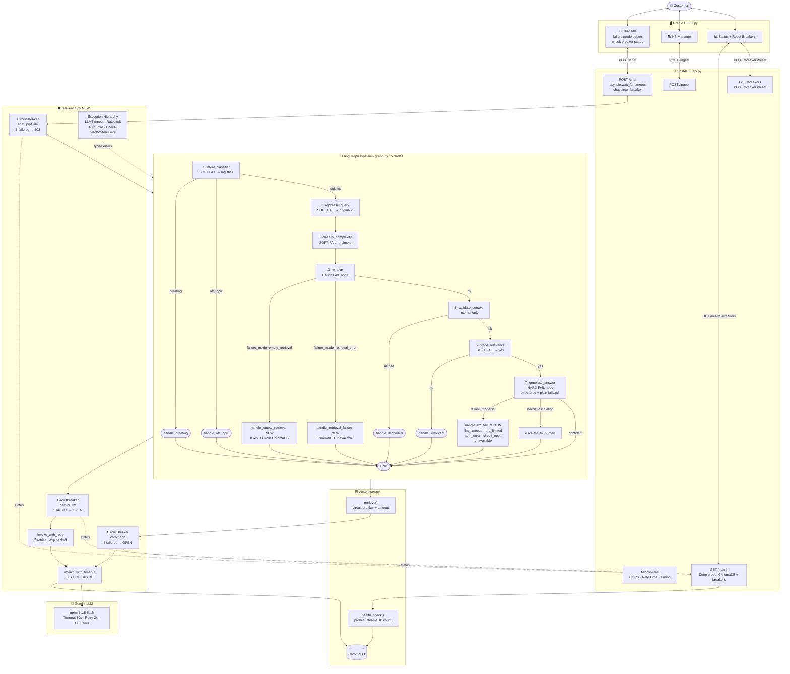

# 📦 Week 6 · Day 2 — Customer Support RAG Agent: Failure Handling

> **Focus**: Every external I/O boundary is hardened against real-world failure
> **Stack**: FastAPI · ChromaDB · Google Gemini · LangGraph · Gradio

---

## 🆚 What's New vs Day 1

| Layer | Day 1 | Day 2 |
|---|---|---|
| **Resilience module** | ❌ | ✅ `resilience.py` — timeout, retry, circuit breaker |
| **LLM timeout** | Hung forever on slow call | 30s timeout → `LLMTimeoutError` |
| **LLM retry** | Single attempt | 2 retries + exponential back-off (1s, 2s) |
| **LLM circuit breaker** | ❌ | ✅ Opens after 5 consecutive LLM failures |
| **ChromaDB circuit breaker** | ❌ | ✅ Opens after 5 consecutive DB failures |
| **Chat pipeline circuit breaker** | ❌ | ✅ API-level; returns HTTP 503 when open |
| **Graph pipeline timeout** | Blocked indefinitely | `asyncio.wait_for` → HTTP 504 |
| **Empty retrieval handling** | Fell through to irrelevant | Dedicated `handle_empty_retrieval` node |
| **Retrieval failure handling** | Unhandled exception | Dedicated `handle_retrieval_failure` node |
| **LLM failure routing** | Generic fallback string | Dedicated `handle_llm_failure` with typed messages |
| **ChromaDB health check** | ❌ | ✅ `health_check()` probed by `/health` |
| **Deep `/health` endpoint** | Liveness only | Probes ChromaDB + all circuit breaker states |
| **`/breakers` endpoint** | ❌ | ✅ Live circuit breaker status |
| **`POST /breakers/reset`** | ❌ | ✅ Manual reset (post-incident recovery) |
| **`failure_mode` in response** | ❌ | ✅ Surfaced in `ChatResponse` and UI badge |
| **Graph nodes** | 12 nodes | 15 nodes (+3 failure nodes) |
| **HTTP status codes** | 200/422/500 | + 503 (circuit open / DB down) / 504 (timeout) |

---

## 🗂️ Project Structure

```
Week 6/Day 2 - Failure Handling RAG Agent/
├── config.py         ← + LLM_TIMEOUT, LLM_MAX_RETRIES, GRAPH_TIMEOUT, CB thresholds
├── logger.py         ← Unchanged from Day 1
├── resilience.py     ← NEW — timeout wrapper, retry w/ backoff, CircuitBreaker
├── ingestor.py       ← Unchanged from Day 1
├── vectorstore.py    ← + health_check(), circuit-breaker-guarded retrieve()
├── memory.py         ← Unchanged from Day 1
├── graph.py          ← + failure_mode state, 3 new failure nodes, typed routing
├── api.py            ← + asyncio timeout, chat circuit breaker, /breakers endpoints
├── ui.py             ← + failure mode badge, circuit breaker status, reset button
└── sample_docs/
    ├── shipping_policy.txt
    └── tracking_guide.txt
```

---

## ▶️ How to Run

```powershell
.\\venv\\Scripts\\activate

# Terminal 1 — Backend API
python "Week 6\\Day 2 - Failure Handling RAG Agent\\api.py"

# Terminal 2 — Gradio UI
python "Week 6\\Day 2 - Failure Handling RAG Agent\\ui.py"
```

| Service | URL |
|---|---|
| Gradio UI | http://localhost:7860 |
| Swagger Docs | http://localhost:8000/docs |
| Health (deep) | http://localhost:8000/health |
| Circuit Breakers | http://localhost:8000/breakers |

---

## 🧪 Failure Scenarios & How They Are Handled

| Scenario | What Happens | User Sees |
|---|---|---|
| **No documents uploaded** | `is_empty()` → graph routes to `handle_empty_retrieval` | "No documents found" + contact info |
| **0 results from ChromaDB** | `retrieve()` returns `[]` → `failure_mode = "empty_retrieval"` | "No documents matched" + suggestions |
| **ChromaDB connection failure** | `VectorStoreError` raised → `failure_mode = "retrieval_error"` | "KB temporarily unavailable" + contact |
| **ChromaDB timeout (>10s)** | `invoke_with_timeout` raises `LLMTimeoutError` → wrapped as `VectorStoreError` | Same as above |
| **ChromaDB repeated failures** | `vectorstore_breaker` opens → rejects further calls | Same as above |
| **LLM call timeout (>30s)** | `LLMTimeoutError` → `failure_mode = "llm_timeout"` | "AI taking too long, try again" |
| **LLM rate limit (429)** | `LLMRateLimitError` → retry ×2 → `failure_mode = "llm_rate_limited"` | "AI at capacity, wait 1 min" |
| **Invalid API key** | `LLMAuthError` → NO retry → `failure_mode = "llm_auth_error"` | "Config issue, team notified" |
| **Network down to Google** | `LLMUnavailableError` → retry ×2 → `failure_mode = "llm_unavailable"` | "AI unreachable, try shortly" |
| **LLM circuit open** | `CircuitOpenError` → `failure_mode = "llm_circuit_open"` | "AI paused, retry in 60s" |
| **Structured output parse fail** | Falls back to plain `llm.invoke` call | Normal answer, lower confidence |
| **Plain fallback also fails** | Hard failure → `failure_mode` set | LLM failure message |
| **Full pipeline timeout (>90s)** | `asyncio.wait_for` raises `TimeoutError` → HTTP 504 | "Request timed out" |
| **Repeated graph crashes** | `chat_circuit_breaker` opens → HTTP 503 | "Service paused, retry in 60s" |
| **Intent classifier LLM error** | Default to `"logistics"` (soft fail) | Pipeline continues normally |
| **Rephrase query LLM error** | Use original question (soft fail) | Pipeline continues normally |
| **Complexity classifier error** | Default to `"simple"` (soft fail) | Pipeline continues normally |
| **Relevance grader error** | Default to `"yes"` (optimistic soft fail) | Pipeline continues normally |
| **Corrupted/junk document chunks** | Validate context strips them (Day 1 logic) | "Degraded context" message |
| **File too large** | `IngestorError` → HTTP 422 + `FILE_TOO_LARGE` | Error in UI upload panel |
| **Bad file type** | `IngestorError` → HTTP 422 + `INVALID_FILE_TYPE` | Error in UI upload panel |

---

## 🏛️ Architecture Diagram (Mermaid)



---

## 🔑 New Error Codes (Day 2 additions)

| Code | HTTP | Trigger |
|---|---|---|
| `LLM_TIMEOUT` | 200 (in answer) | LLM call > 30s |
| `LLM_RATE_LIMITED` | 200 (in answer) | HTTP 429 from Gemini |
| `LLM_AUTH_ERROR` | 200 (in answer) | Bad API key |
| `LLM_CIRCUIT_OPEN` | 200 (in answer) | LLM circuit breaker OPEN |
| `LLM_UNAVAILABLE` | 200 (in answer) | Network error after retries |
| `VECTOR_STORE_ERROR` | 503 | ChromaDB unavailable on ingest |
| `CHAT_CIRCUIT_OPEN` | 503 | Chat pipeline circuit breaker OPEN |
| `GRAPH_TIMEOUT` | 504 | Full pipeline > 90s |
