# 📦 Week 7 · Day 1 — Customer Support RAG Agent: Logging & Observability

> **Focus**: Industry-standard, production-grade structured logging and observability across every layer of the RAG pipeline  
> **Stack**: FastAPI · ChromaDB · Google Gemini · LangGraph · Gradio

---

## 🆚 What's New vs Week 6 Day 2

| Area | Week 6 Day 2 | Week 7 Day 1 |
|---|---|---|
| **Prompt logging** | ❌ Never logged | ✅ Truncated preview at INFO; full text at DEBUG (`LOG_PROMPT=true`) |
| **Token tracking** | ❌ Not tracked | ✅ `estimate_tokens()` at every LLM call — tokens_in, tokens_out, total_tokens |
| **Node-level latency** | ⚠️ Only `generate_answer` | ✅ Every graph node wrapped in `TracingContext` |
| **Trace ID** | ❌ None | ✅ UUID4 per `/chat` request, threaded through all nodes + returned in `ChatResponse` |
| **Log file** | stdout only | ✅ `RotatingFileHandler` → `logs/rag_agent.log` (10 MB × 5 backups) |
| **Log level control** | Hardcoded INFO | ✅ `LOG_LEVEL` env var (`DEBUG`/`INFO`/`WARNING`) |
| **LLM call audit** | Single line | ✅ Structured audit: model, tokens_in, tokens_out, latency_ms, success, attempt |
| **Error tracebacks** | `str(e)` only | ✅ Full `traceback` captured as structured JSON field |
| **Retrieval audit** | chunk count only | ✅ `log_retrieval()`: query, top_k, category, chunks, sizes, context_tokens, latency |
| **Ingest audit** | minimal | ✅ Pre-flight: char_count, token_estimate, doc_type, chunk stats, latency |
| **Session lifecycle** | basic | ✅ turn_count, age, idle time, TTL proximity warning |
| **Circuit breaker transitions** | state only | ✅ from_state → to_state + failure_count |
| **Retry logging** | attempt + delay | ✅ + error_type, error_code, trace_id |
| **`/logs` endpoint** | ❌ | ✅ `GET /logs?last_n=N` — last N lines from file |
| **`/metrics` token totals** | ❌ | ✅ `total_tokens_in`, `total_tokens_out` |
| **Logs Viewer UI tab** | ❌ | ✅ Tab 4 — live log viewer with formatter |
| **Trace ID in UI** | ❌ | ✅ Displayed per response for support correlation |
| **`observability.py`** | ❌ | ✅ New central observability engine |
| **Version** | 2.0.0 | 3.0.0 |

---

## 🗂️ Project Structure

```
Week 7/Day 1 - Logging and Observability/
├── config.py         ← + LOG_LEVEL, LOG_DIR, LOG_FILE_MAX_BYTES, LOG_FILE_BACKUP_COUNT, LOG_PROMPT
├── logger.py         ← + LOG_LEVEL env var, trace_id surfaced in JSON, _JsonFormatter exported
├── observability.py  ← ★ NEW — core observability engine
│                          init_logging(), new_trace_id(), log_llm_call(),
│                          log_retrieval(), log_prompt(), estimate_tokens(), TracingContext,
│                          tail_log_file()
├── resilience.py     ← + trace_id in retry/CB logs, from/to state transitions
├── ingestor.py       ← Unchanged from Day 2
├── vectorstore.py    ← + log_retrieval() call, ingest pre-flight log, trace_id passthrough
├── memory.py         ← + session lifecycle logs, TTL warning, trace_id on get/add
├── graph.py          ← + trace_id in AgentState, TracingContext on all nodes,
│                          log_prompt() + log_llm_call() at every LLM call
├── api.py            ← + init_logging() at startup, trace_id per /chat, /logs endpoint,
│                          token totals in /metrics, trace_id in ChatResponse
├── ui.py             ← + Trace ID display, Tab 4 Logs Viewer (polls /logs)
├── logs/
│   └── .gitkeep      ← Directory tracked; rag_agent.log created at runtime
└── sample_docs/
    ├── shipping_policy.txt
    └── tracking_guide.txt
```

---

## ▶️ How to Run

```powershell
.\venv\Scripts\activate

# Terminal 1 — Backend API
python "Week 7\Day 1 - Logging and Observability\api.py"

# Terminal 2 — Gradio UI
python "Week 7\Day 1 - Logging and Observability\ui.py"
```

| Service | URL |
|---|---|
| Gradio UI | http://localhost:7860 |
| Swagger Docs | http://localhost:8000/docs |
| Health (deep) | http://localhost:8000/health |
| Circuit Breakers | http://localhost:8000/breakers |
| **Log Tail** | **http://localhost:8000/logs?last_n=50** |

---

## ⚙️ Configuration Reference

All values can be overridden in a `.env` file in the project root.

### Existing Keys (unchanged from Day 2)

| Key | Default | Description |
|---|---|---|
| `GOOGLE_API_KEY` | — | **Required** — Gemini API key |
| `LLM_MODEL` | `gemini-1.5-flash` | Gemini model name |
| `LLM_TEMPERATURE` | `0.2` | Sampling temperature |
| `LLM_TIMEOUT_SECONDS` | `30` | Per-LLM-call timeout |
| `LLM_MAX_RETRIES` | `2` | Retry attempts on transient errors |
| `GRAPH_TIMEOUT_SECONDS` | `90` | Full pipeline asyncio timeout |
| `CIRCUIT_BREAKER_FAILURE_THRESHOLD` | `5` | Failures before circuit opens |
| `API_KEY` | *(none)* | Optional Bearer key for all endpoints |

### ★ New Observability Keys

| Key | Default | Description |
|---|---|---|
| `LOG_LEVEL` | `INFO` | Log verbosity: `DEBUG` / `INFO` / `WARNING` / `ERROR` |
| `LOG_DIR` | `./logs` | Directory for rotating log files |
| `LOG_FILE_MAX_BYTES` | `10485760` | Rotate at this file size (10 MB) |
| `LOG_FILE_BACKUP_COUNT` | `5` | Number of archived logs to keep |
| `LOG_PROMPT` | `false` | If `true`, writes full prompt text at DEBUG level |

> **Privacy**: `LOG_PROMPT=false` (default) ensures raw customer queries are never written to disk in full. Enable only for local debugging.

---

## 📊 Observability Coverage Map

Every log entry is a JSON object on a single line. Fields always present: `ts`, `level`, `component`, `msg`. Additional fields depend on the event type.

| Signal | Where emitted | Key fields |
|---|---|---|
| **HTTP request** | Middleware | `trace_id`, `method`, `path`, `status`, `duration_ms`, `client` |
| **Prompt (preview)** | Every LLM node | `trace_id`, `node`, `prompt_chars`, `tokens_estimate`, `prompt_hash`, `prompt_preview` |
| **Prompt (full)** | Every LLM node *(LOG_PROMPT=true)* | `prompt_full` |
| **LLM call result** | Every LLM node | `trace_id`, `node`, `model`, `tokens_in`, `tokens_out`, `total_tokens`, `latency_ms`, `success`, `attempt` |
| **LLM call error** | Every LLM node | + `error`, `error_type`, `traceback` |
| **Retrieval** | `retrieve` node / vectorstore | `trace_id`, `query_chars`, `top_k_requested`, `category_filter`, `chunks_returned`, `chunk_sizes`, `avg_chunk_chars`, `total_context_tokens`, `latency_ms` |
| **Node entry/exit** | Every graph node | `trace_id`, `operation`, `session_id`, `latency_ms` |
| **Ingest pre-flight** | `vectorstore.ingest_document` | `trace_id`, `source`, `char_count`, `total_tokens_estimate`, `doc_type`, `raw_chunks`, `clean_chunks`, `avg_chunk_tokens` |
| **Circuit breaker transition** | `resilience.py` | `service`, `from_state`, `to_state`, `failure_count`, `reset_in_seconds` |
| **Retry attempt** | `resilience.py` | `trace_id`, `attempt`, `max_retries`, `retry_in_seconds`, `error_type`, `error_code` |
| **Session lifecycle** | `memory.py` | `session_id`, `trace_id`, `turn_count`, `age_seconds`, `idle_seconds`, `ttl_warning` |
| **Error (hard)** | All error handlers | `trace_id`, `error_type`, `error`, `traceback` |

---

## 🔎 How to Use the Trace ID

1. Send a chat message in the **💬 Chat** tab
2. Note the **Trace ID** displayed in the Response Details panel (right column)
3. Switch to the **📜 Logs Viewer** tab and click **Fetch Logs**
4. Search (`Ctrl+F`) for the first 8 characters of the Trace ID to see every log entry for that request — from HTTP middleware → intent classification → retrieval → answer generation

Alternatively, hit the API directly:
```bash
GET http://localhost:8000/logs?last_n=200
```

---

## 🏛️ Architecture Diagram

```mermaid
flowchart TD
    USER(["👤 Customer"])

    subgraph UI["🖥️ Gradio UI  •  ui.py  v3"]
        CHAT["💬 Chat Tab\ntrace_id display"]
        KB["📚 KB Manager"]
        STATUS["📊 Status Tab"]
        LOGS["📜 Logs Viewer Tab ★ NEW\npolls GET /logs"]
    end

    subgraph API["⚡ FastAPI  •  api.py  v3"]
        INIT["init_logging()\nstartup — wires RotatingFileHandler"]
        MW["Middleware\nCORS · Rate Limit · Timing · trace_id"]
        EP_CHAT["POST /chat\ntrace_id generated here\ninjected into graph_input"]
        EP_INGEST["POST /ingest\ntrace_id per ingest"]
        EP_HEALTH["GET /health"]
        EP_LOGS["GET /logs ★ NEW\ntail_log_file()"]
        EP_METRICS["GET /metrics\n+ total_tokens_in/out"]
    end

    subgraph OBS["🔭 observability.py  ★ NEW"]
        INIT_L["init_logging()\nRotatingFileHandler"]
        TRACE["new_trace_id() — UUID4"]
        LOG_LLM["log_llm_call()\nmodel · tokens · latency · success"]
        LOG_RET["log_retrieval()\nquery · top_k · chunks · sizes · latency"]
        LOG_PROMPT["log_prompt()\npreview + hash + token estimate"]
        EST["estimate_tokens()\n~4 chars/token heuristic"]
        TRACING["TracingContext\nper-node latency + trace_id"]
        TAIL["tail_log_file()\nlast N lines from disk"]
    end

    subgraph GRAPH["🔄 LangGraph 15 nodes  •  graph.py"]
        N1["intent_classifier\nTracingContext + log_prompt + log_llm_call"]
        N2["rephrase_query\nTracingContext + log_prompt + log_llm_call"]
        N3["classify_complexity\nTracingContext + log_prompt + log_llm_call"]
        N4["retrieve\nTracingContext → vectorstore.retrieve(trace_id)"]
        N5["validate_context\nTracingContext + chunk drop count"]
        N6["grade_relevance\nTracingContext + log_prompt + log_llm_call"]
        N7["generate_answer\nTracingContext + log_prompt + log_llm_call ×2\nstructured + plain fallback"]
        TNODES["Terminal nodes\n(off_topic · greeting · failures…)\ntrace_id in every log entry"]
    end

    subgraph STORE["💾 logs/rag_agent.log"]
        FILE["RotatingFileHandler\n10 MB × 5 backups\nJSON-line format"]
    end

    USER <--> CHAT & KB & STATUS & LOGS
    CHAT -->|"POST /chat"| EP_CHAT
    KB   -->|"POST /ingest"| EP_INGEST
    LOGS -->|"GET /logs"| EP_LOGS
    STATUS -->|"GET /health /metrics"| EP_HEALTH & EP_METRICS

    INIT --> INIT_L --> FILE
    EP_CHAT --> TRACE --> GRAPH
    EP_LOGS --> TAIL --> FILE

    N1 & N2 & N3 & N6 & N7 --> LOG_PROMPT & LOG_LLM & EST
    N4 --> LOG_RET
    N1 & N2 & N3 & N4 & N5 & N6 & N7 & TNODES --> TRACING

    TRACING & LOG_LLM & LOG_RET & LOG_PROMPT --> FILE
```



---

## 📜 Sample Log Output

Each line is a valid JSON object — easy to pipe into `jq`, ship to CloudWatch, or ingest into Elasticsearch.

```json
{"ts":"2026-04-23T09:00:01.123+00:00","level":"INFO","component":"api","msg":"Chat request received","trace_id":"a1b2c3d4-...","session_id":"user-abc","query_chars":42,"query_preview":"What is the delivery SLA for Zone 3?"}
{"ts":"2026-04-23T09:00:01.130+00:00","level":"INFO","component":"graph","msg":"Prompt prepared","trace_id":"a1b2c3d4-...","node":"intent_classifier","prompt_chars":312,"tokens_estimate":78,"prompt_hash":"3f9a1b2c4e5d6f7a"}
{"ts":"2026-04-23T09:00:01.890+00:00","level":"INFO","component":"graph","msg":"LLM call completed","trace_id":"a1b2c3d4-...","node":"intent_classifier","model":"gemini-1.5-flash","tokens_in":78,"tokens_out":2,"total_tokens":80,"latency_ms":760,"success":true,"attempt":1}
{"ts":"2026-04-23T09:00:02.200+00:00","level":"INFO","component":"vectorstore","msg":"Retrieval completed","trace_id":"a1b2c3d4-...","top_k_requested":3,"category_filter":"none","chunks_returned":3,"latency_ms":95,"chunk_sizes":[487,512,431],"avg_chunk_chars":476,"total_context_tokens":357}
{"ts":"2026-04-23T09:00:04.100+00:00","level":"INFO","component":"graph","msg":"generate_answer.structured completed","trace_id":"a1b2c3d4-...","operation":"generate_answer.structured","latency_ms":1900,"session_id":"user-abc"}
{"ts":"2026-04-23T09:00:04.110+00:00","level":"INFO","component":"api","msg":"Pipeline completed","trace_id":"a1b2c3d4-...","session_id":"user-abc","latency_ms":2980,"failure_mode":null,"confidence":0.93,"escalated":false}
```

---

## 🔑 New Error Codes (Week 7 Day 1 additions)

No new HTTP error codes — all existing Day 2 codes remain. The `trace_id` field is now included in all error JSON responses to help operators correlate incidents with log entries.
